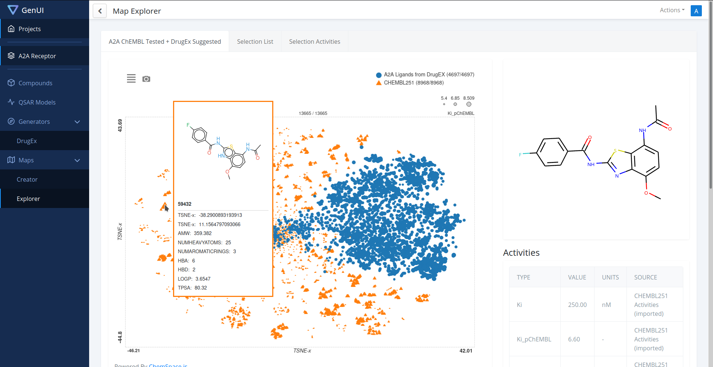

    

# About

This is the GenUI frontend application. It is based on [Vibe](https://github.com/NiceDash/Vibe) (v1.0.2),
a neat [React.js](https://reactjs.org/) dashboard built with [Bootstrap 4](https://getbootstrap.com/docs/4.0/getting-started/introduction/). It provides
a GUI to the [GenUI REST API web services](https://github.com/martin-sicho/genui/).

## Quick Start

- Install dependencies by running `yarn` or `npm install`.
- Run `yarn start` or `npm run start` to start the local dev server.

The development server will look for the GenUI backend service running
at `http://localhost:8000` and it will use REST API endpoints found under 
`http://localhost:8000/api/`.

## Documentation

The GenUI/Vibe dashboard is based on [Create React App](https://create-react-app.dev/). 
Follow the documentation there for an introduction of the development environment.

## Custom GenUI Components

The original library of components defined in the Vibe dashboard was extended with 
custom reusable components designated to be used in GenUI. You can import
those components from the package located in `./src/genui/`. You can find 
the package with the original Vibe components in `./src/vibe`. 

If you want to expand the GUI using these components, 
you should take a look at the currently defined pages 
of the dashboard in `./src/views/pages` for example use 
of these components.

## The Layout

The basic dashboard layout is defined in `./src/views/layouts/DashboardLayout.js`. 
You can modify parts of the Vibe layout with the following code:

Part | Modification
--- | ---
CSS | Sass files can be found in `./src/vibe/scss`. Update `./src/vibe/scss/components/vars.scss` to change global styles.
Responsivity | Configure the switch between mobile and desktop layout with the constant `MOBILE_SIZE`
Logo | Change file `./src/assets/images/vibe-logo.svg` or import a different `Logo`
Chat | Enable/Disable it by default by setting the initial state of `showChat1`
Header | Change function component `HeaderNav`.
Footer | Change the `<Footer>` part in the `render()` function of DashboardLayout.
Menu | See below.

### Creating a new page

1. Create your page as component in the folder `./src/views/pages`. (You can actually create these components anywhere you wish, this is just a recommendation.)
1. Add your component to the `pageList` array in `./src/views/index.js`.
1. Call it by opening the route you've chosen. You can use the `Route` component
(see [Routes documentation](https://reacttraining.com/react-router/web/api/Route/exact-bool))  
of [react-router-dom](https://reacttraining.com/react-router/web/guides/quick-start).

### Creating a menu entry

All pages are accessible by their routes, but only pages added to 
the `nav` state property of `DashboardLayout` or manually defined in `./src/_nav.js` 
show up on the sidebar menu. There are two menus available to fill: `top` and `bottom`.

Every top level menu entry can either be a top level button or a folder with a single level of child entries.

Key | Value
--- | ---
`name` | Display name of the menu entry
`icon` | (Optional) Icon prefixed to the display name. The correct item gets autoloaded by Vibe. ([react-feather](https://www.npmjs.com/package/react-feather) is used for icons.
`url` | (Optional) Either a relative URL to the target page or an absolute URL to an external page (For linked menu entries. Make sure relative URLs start with a slash, i.e. `/home`)
`external` | (Optional) Set to `true` if the `url` points to an external page.
`target` | (Optional) Set to `_blank` if you want the link to an external page to open in a new window.
`children` | (Optional) Child entries as array (For folder menu entries)
`divider` | (Optional) Inserts a visual divider if set to true (Use this instead of a menu entry)

*Note:* If you wish menus to be expanded by default, you have to change the initial state of `open` in `./src/vibe/components/SidebarNav/components/NavDropdownItem.js`.

### Using Bootstrap / reactstrap

Vibe is using the Bootstrap-for-React library [reactstrap](https://reactstrap.github.io/). 
Follow the [components documentation](https://reactstrap.github.io/components/) for using them 
in a Vibe Dashboard.

Note that Vibe overwrites the default Bootstrap styles in `./src/vibe/scss/components/`.

Custom Vibe components are in the `./src/vibe/components/` directory.

### Using Feather icons

Vibe is using [react-feather](https://www.npmjs.com/package/react-feather) for its icons.

A nice overview over all available icons can be found on <https://feathericons.com/>.

*Note:* In order to use a Feather icon in react, convert the name to camel case. (I.e. `alert-circle` becomes `AlertCircle`).
